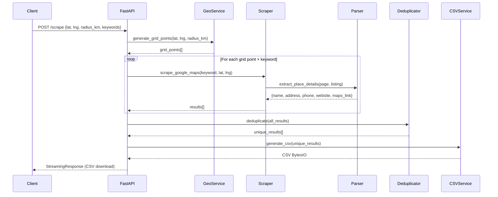

# Google Maps Psychologist/Psychiatrist Scraping Service

Build a scalable, production-ready Python scraping service that extracts psychologist and psychiatrist listings from Google Maps and exposes results via a FastAPI endpoint returning a downloadable CSV.

## Background

Google Maps renders all data via JavaScript and uses dynamically generated class names. The scraper must use a real browser (Playwright) with stealth settings, prefer `aria-label` and `role` attribute selectors over brittle CSS classes, and implement anti-detection measures (random delays, user-agent rotation, stealth plugin).

---

## User Review Required

> [!IMPORTANT]
> **Legal Disclaimer**: Scraping Google Maps may violate Google's Terms of Service. This tool is intended for educational/research purposes. Use responsibly and consider the official [Google Places API](https://developers.google.com/maps/documentation/places/web-service/overview) for production-grade needs.

> [!WARNING]
> **Anti-Bot Detection**: Google actively detects and blocks scrapers. The service includes basic stealth measures (random delays, user-agent rotation, `playwright-stealth`), but sustained high-volume scraping will likely require rotating residential proxies (not included in this implementation).

---

## Proposed Changes

### Project Structure

```
GoogleMapsScraper/
├── app/
│   ├── __init__.py
│   ├── main.py                    # FastAPI entry point
│   ├── scraper/
│   │   ├── __init__.py
│   │   ├── maps_scraper.py        # Core Playwright scraping engine
│   │   └── parser.py              # Data extraction from detail panels
│   ├── services/
│   │   ├── __init__.py
│   │   ├── csv_service.py         # CSV generation via Pandas
│   │   └── geo_service.py         # Geocoding & grid generation
│   └── utils/
│       ├── __init__.py
│       └── deduplicator.py        # Deduplication logic
├── requirements.txt
├── README.md
└── .env.example
```

---

### Dependencies

#### [NEW] [requirements.txt](file:///Users/pratyakshtrivedi/Developer/GoogleMapsScraper/requirements.txt)

```
fastapi>=0.110.0
uvicorn[standard]>=0.27.0
playwright>=1.42.0
playwright-stealth>=1.0.6
pandas>=2.2.0
geopy>=2.4.1
python-dotenv>=1.0.0
pydantic>=2.6.0
```

---

### API Layer (FastAPI)

#### [NEW] [main.py](file:///Users/pratyakshtrivedi/Developer/GoogleMapsScraper/app/main.py)

- **`POST /scrape`** — Primary endpoint
  - Accepts JSON body with `ScrapeRequest` model:
    - `lat` (float, optional) — Latitude
    - `lng` (float, optional) — Longitude  
    - `district` (str, optional) — District name (alternative to lat/lng)
    - `state` (str, optional) — State name (alternative to lat/lng)
    - `radius_km` (int, default=10) — Search radius in km
    - `keywords` (list[str], default=["psychologist", "psychiatrist"]) — Customizable search terms
  - Validates that either `(lat, lng)` or `(district, state)` are provided
  - Orchestrates: geocoding → grid generation → scraping → deduplication → CSV generation
  - Returns `StreamingResponse` with `Content-Disposition: attachment; filename=results_<timestamp>.csv`

- **`GET /health`** — Health check

---

### Scraper Engine

#### [NEW] [maps_scraper.py](file:///Users/pratyakshtrivedi/Developer/GoogleMapsScraper/app/scraper/maps_scraper.py)

Core scraping logic using async Playwright:

1. **`scrape_google_maps(keyword: str, lat: float, lng: float) -> list[dict]`**
   - Launches headless Chromium with `playwright-stealth`
   - Navigates to `https://www.google.com/maps/search/{keyword}+near+{lat},{lng}/`
   - Handles cookie consent dialogs if present
   - Waits for `div[role="feed"]` (results container) to appear
   - Scrolls the feed container repeatedly using `element.evaluate('el => el.scrollTop = el.scrollHeight')` 
   - Detects scroll completion: checks if `scrollHeight` stops increasing after 3 consecutive attempts
   - Collects all listing elements via `a[href*="/maps/place/"]` within the feed
   - Calls `parser.extract_place_details()` for each listing
   - Implements retry logic (max 3 retries per listing with exponential backoff)

2. **Anti-Detection Measures**:
   - `playwright-stealth` to mask `navigator.webdriver`
   - Random delays between actions (1-3s between clicks, 0.5-1.5s between scrolls)
   - Randomized user-agent strings from a pool of 10+ real Chrome user-agents
   - Randomized viewport sizes

---

### Data Extraction

#### [NEW] [parser.py](file:///Users/pratyakshtrivedi/Developer/GoogleMapsScraper/app/scraper/parser.py)

Extracts structured data from each place listing:

1. **`extract_place_details(page, listing_element) -> dict`**
   - Clicks the listing to open the detail panel
   - Waits for the detail panel to load (presence of `h1` or `[role="main"]`)
   - Extracts fields using `aria-label` based selectors (most stable):
     - **Name**: `h1` text content within the detail panel, or `[role="main"] [aria-label]`
     - **Address**: `button[data-item-id="address"]` or `[aria-label*="Address"]`  
     - **Phone**: `button[data-item-id*="phone"]` or `[aria-label*="Phone"]`
     - **Website**: `a[data-item-id="authority"]` or `[aria-label*="Website"]`
     - **Maps Link**: Current page URL (`page.url`)
   - Each field extraction wrapped in try/except returning `None` if missing
   - Returns dict: `{"name", "address", "phone", "website", "maps_link"}`

2. **Fallback Strategy**: If `aria-label` selectors fail, tries `data-item-id` attributes, then text-content matching patterns.

---

### Geo Service

#### [NEW] [geo_service.py](file:///Users/pratyakshtrivedi/Developer/GoogleMapsScraper/app/services/geo_service.py)

1. **`geocode_location(district: str, state: str) -> tuple[float, float]`**
   - Uses `geopy.geocoders.Nominatim` with a custom `user_agent`
   - Converts "district, state, India" to (lat, lng)
   - Raises `ValueError` if location not found

2. **`generate_grid_points(center_lat, center_lng, radius_km, step_km=5) -> list[tuple[float, float]]`**
   - Generates a grid of lat/lng points covering the radius
   - Uses the Haversine-based offset formula:
     - `lat_offset = step_km / 111.0` (1° lat ≈ 111 km)
     - `lng_offset = step_km / (111.0 * cos(radians(center_lat)))` 
   - Returns list of (lat, lng) tuples forming a grid

---

### CSV Service

#### [NEW] [csv_service.py](file:///Users/pratyakshtrivedi/Developer/GoogleMapsScraper/app/services/csv_service.py)

1. **`generate_csv(data: list[dict]) -> io.BytesIO`**
   - Creates a Pandas DataFrame from the list of dicts
   - Columns: `[Name, Address, Phone, Website, Maps Link]`
   - Returns CSV as a BytesIO stream (no file written to disk for ephemeral response)

2. **`save_csv(data: list[dict], filename: str) -> str`**
   - Saves to disk for intermediate results
   - Returns file path

---

### Deduplication

#### [NEW] [deduplicator.py](file:///Users/pratyakshtrivedi/Developer/GoogleMapsScraper/app/utils/deduplicator.py)

1. **`deduplicate(results: list[dict]) -> list[dict]`**
   - Primary key: `maps_link` (unique Google Maps place URL)
   - Secondary check: `name.lower().strip() + address.lower().strip()` for catching duplicates with different URL formats
   - Returns deduplicated list preserving order

---

## Request Flow Diagram



---

## Open Questions

> [!IMPORTANT]
> **Country Scope**: The geocoding currently defaults to appending "India" for district+state lookups. Should this be configurable or is India the only target region?

> [!NOTE]
> **Concurrent Scraping**: Should multiple grid points be scraped concurrently (faster but higher detection risk) or sequentially (slower but safer)? The plan currently uses **sequential** scraping for safety. We can add a concurrency option later.

---

## Verification Plan

### Automated Tests
1. Run `pip install -r requirements.txt && playwright install chromium` to verify dependency installation
2. Start the FastAPI server with `uvicorn app.main:app --reload`
3. Test the `/health` endpoint via `curl`
4. Test the `/scrape` endpoint with a small radius (1-2 km) to verify end-to-end flow
5. Verify the returned CSV file has correct columns and data

### Manual Verification
- Use the browser subagent to navigate to the running FastAPI Swagger UI (`/docs`) and test the endpoint
- Verify the CSV download contains valid, deduplicated results
- Check logs for scraping progress and error handling
